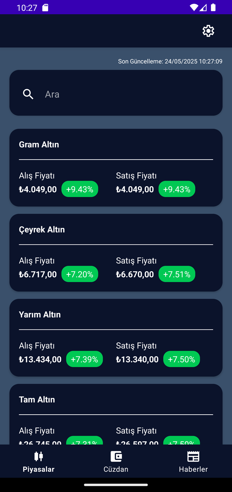
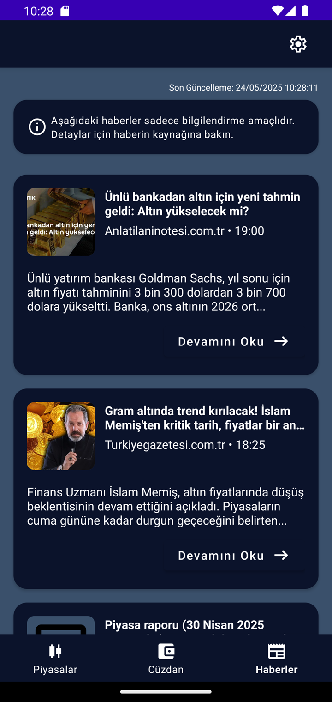
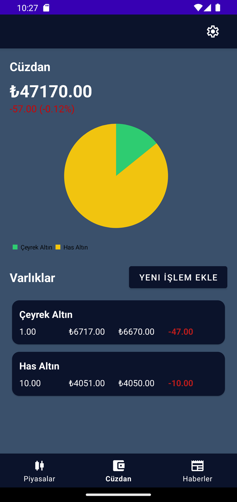
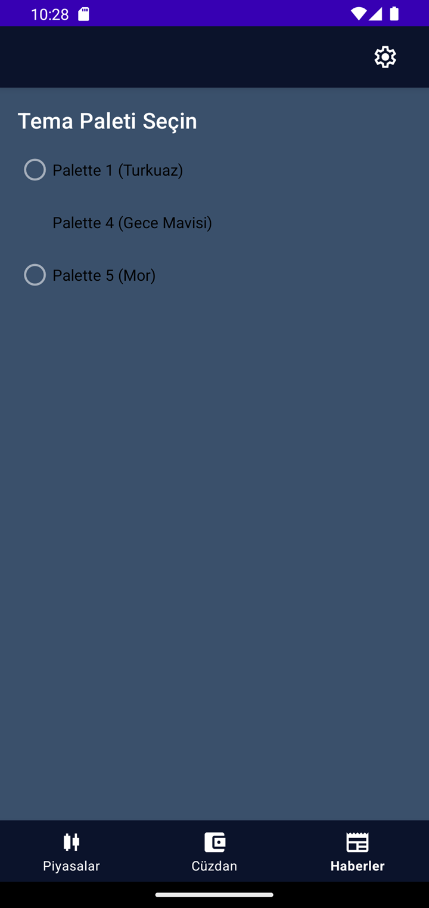

# GoldBazaar

## Overview
A comprehensive gold market tracking application that provides real-time gold prices, market analysis, and portfolio management features. The system combines automated data collection from multiple sources, robust backend APIs, and an intuitive mobile interface to deliver accurate gold market insights to users.

## Links
- [GoldBazaar API Doc](https://staging-api.goldmarketcap.xyz/swagger/index.html)

## Purpose
To create a reliable platform for gold market enthusiasts, investors, and traders who need real-time gold price tracking, historical data analysis, and portfolio management tools. GoldBazaar aims to democratize access to gold market information through automated data collection and user-friendly interfaces.

## Scope

### Technology Stack:
- **Data Collection**: Python 3.x, BeautifulSoup4, Requests, NumPy, Pandas
- **Database**: MongoDB with PyMongo
- **Backend API**: .NET 8.0, ASP.NET Core, MongoDB.Driver
- **Mobile Frontend**: Android (Kotlin), Retrofit, Material Design
- **Documentation**: Swagger/OpenAPI

## Implementation

### Python
```
gold_price_manager/
├── data_sources/
│   ├── __init__.py
│   ├── base_source.py
│   ├── interface.py
│   └── uzmanpara_source.py
├── models/
│   ├── __init__.py
│   ├── gold_price.py
│   └── percentage_model.py
├── processors/
│   ├── __init__.py
│   ├── data_validator.py
│   └── percentage_calculator.py
├── utils/
│   ├── __init__.py
│   ├── db_handler.py
│   ├── logger.py
│   └── validators.py
├── .env
├── .env.example
├── __init__.py
├── config.py
├── gold_price_manager.log
├── main.py
└── README.md
```

### .NET API
```
./
├── GoldBazaar/
│   ├── Controllers/
│   ├── Extensions/
│   ├── Middleware/
│   └── Properties/
├── GoldBazaar.Application/
│   ├── DTOs/
│   ├── DependencyInjection/
│   ├── Exceptions/
│   ├── Filters/
│   ├── Interfaces/
│   ├── Mapping/
│   ├── Services/
│   └── Validators/
├── GoldBazaar.Domain/
│   ├── Entities/
│   ├── Enums/
│   └── Interfaces/
├── GoldBazaar.Infrastructure/
│   ├── Configurations/
│   ├── Context/
│   ├── DependencyInjection/
│   ├── Logging/
│   └── Repositories/
├── GoldBazaar.Shared/
│   ├── Interfaces/
│   └── Models/
└── GoldBazaar.sln
```

### Kotlin
```
frontend/
├── app/
│   ├── src/
│   │   ├── main/
│   │   │   ├── java/com/mulosbron/goldbazaar/
│   │   │   │   ├── di/
│   │   │   │   ├── model/
│   │   │   │   │   ├── entity/
│   │   │   │   │   ├── remote/
│   │   │   │   │   ├── request/
│   │   │   │   │   └── response/
│   │   │   │   ├── repository/
│   │   │   │   │   └── interfaces/
│   │   │   │   ├── service/
│   │   │   │   │   ├── api/
│   │   │   │   │   └── network/
│   │   │   │   ├── util/
│   │   │   │   │   └── ext/
│   │   │   │   ├── view/
│   │   │   │   │   ├── activity/
│   │   │   │   │   ├── adapter/
│   │   │   │   │   └── fragment/
│   │   │   │   │       ├── auth/
│   │   │   │   │       ├── market/
│   │   │   │   │       ├── news/
│   │   │   │   │       ├── settings/
│   │   │   │   │       └── wallet/
│   │   │   │   ├── viewmodel/
│   │   │   │   │   ├── auth/
│   │   │   │   │   ├── market/
│   │   │   │   │   ├── news/
│   │   │   │   │   └── wallet/
│   │   │   │   └── GoldBazaarApplication.kt
│   │   │   ├── res/
│   │   │   └── AndroidManifest.xml
│   │   ├── test/
│   │   └── androidTest/
│   ├── build.gradle.kts
│   └── proguard-rules.pro
├── build.gradle.kts
├── gradle.properties
├── local.properties
└── settings.gradle.kts
```

### API Endpoints
```http
GET /api/gold-daily-percentages/latest
GET /api/gold-daily-percentages/latest/{product}
GET /api/gold-prices/latest
GET /api/gold-prices/latest/{product}
GET /api/gold-news
GET /api/reports/download/{fileType}
```

### Mobile App Features:
- **Market Dashboard**: Real-time gold prices and charts
- **News Feed**: Latest gold market news and analysis
- **Portfolio Tracker**: Personal investment tracking
- **Settings**: App configuration and preferences

### Build Variants:
- **Dev**: Development environment with debug features
- **Staging**: Pre-production testing environment
- **Prod**: Production release build

## Screenshots

### Mobile Application Screens

<table>
  <tr>
    <td align="center">
      
      <br><sub><b>Market</b></sub>
    </td>
    <td align="center">
      
      <br><sub><b>News</b></sub>
    </td>
  </tr>
  <tr>
    <td align="center">
      
      <br><sub><b>Wallet</b></sub>
    </td>
    <td align="center">
      
      <br><sub><b>Settings</b></sub>
    </td>
  </tr>
</table>


### Available Builds
- **Development APK**: `frontend/apk/dev/` - Debug build with development features
- **Staging APK**: `frontend/apk/staging/` - Pre-production testing build
